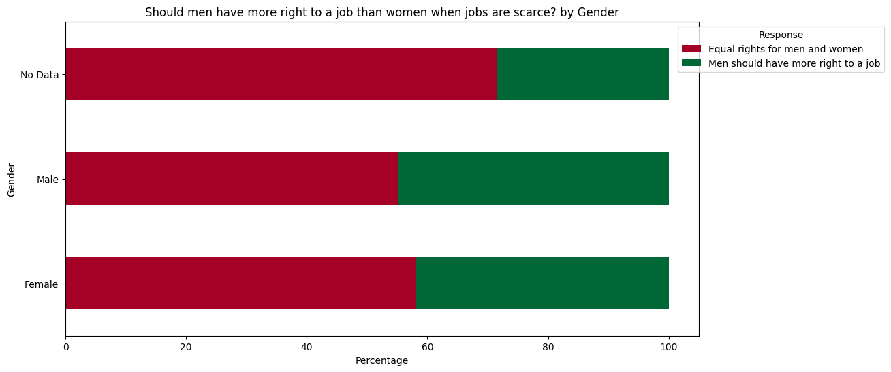

# Gender and Education Influence on Social Attitudes

## Research Question
**How do gender and education influence attitudes toward social issues?**

## Dataset Information
- **Source:** World Values Survey (WVS)
- **Location:** `./WVS_subset.csv`
- **Description:** The dataset contains responses from individuals regarding their attitudes towards social issues, along with demographic information such as gender and education level.

## Table 1: Data Description
| **Variable** | **Description** | **Possible Values** |
|-------------|----------------|---------------------|
| **Q260** | Gender of respondent | 1 = Male, 2 = Female, -2/-5 = No Data |
| **Q275** | Education Level | Converted into readable categories |
| **Q57** | Most people can be trusted? | 1 = Yes, 2 = No |
| **Q69** | Confidence in the police | Scale from 1 (Low) to 4 (High) |
| **Q86** | Confidence in NATO | Scale from 1 (Low) to 4 (High) |
| **Q265** | Is your father an immigrant? | 1 = Yes, 2 = No |
| **Q87** | Confidence in the World Bank | Scale from 1 (Low) to 4 (High) |
| **Q12** | Is tolerance an important child quality? | 1 = Yes, 2 = No |
| **Q30** | Is university more important for boys? | 1 = Agree, 2 = Disagree |
| **Q29** | Do men make better political leaders? | 1 = Agree, 2 = Disagree |
| **Q33** | Should men have more right to a job? | 1 = Agree, 2 = Disagree |
| **Q36** | Are homosexual couples as good parents? | 1 = Agree, 2 = Disagree |

## Table 2: Descriptive Statistics
Below is a dynamically generated table presenting descriptive statistics for five selected key variables:

| **Variable** | **N** | **Mean** | **Std. Dev.** | **Min** | **Median** | **Max** | **Description** |
|-------------|------|------|------------|------|--------|------|----------------|
| Most people can be trusted | 97220 | 2.22 | 1.25 | -5.00 | 2.00 | 4.00 | Measures general trust in people. |
| Confidence in the police | 97220 | 1.53 | 2.32 | -5.00 | 2.00 | 4.00 | Level of trust in law enforcement. |
| Confidence in NATO | 97220 | 1.71 | 2.08 | -5.00 | 1.00 | 4.00 | Trust in international security organizations. |
| Confidence in the World Bank | 97220 | 1.71 | 2.08 | -5.00 | 1.00 | 4.00 | Trust in global financial institutions. |
| Men should have more right to a job | 97220 | 3.02 | 1.42 | -5.00 | 3.00 | 5.00 | Attitudes towards gender bias in employment. |

## Data Visualizations
To better understand the data, the following visualizations have been generated:

### **Figures by Gender**
- **Most people can be trusted? by Gender**  
  
- **How much confidence do you have in the police? by Gender**  
  
- **How much confidence do you have in NATO? by Gender**  
  
- **Is your father an immigrant? by Gender**  
  
- **How much confidence do you have in the World Bank? by Gender**  
  
- **Is tolerance an important child quality? by Gender**  
  
- **Is university more important for boys? by Gender**  
  
- **Do men make better political leaders? by Gender**  
  
- **Should men have more right to a job? by Gender**  
  
- **Are homosexual couples as good parents? by Gender**  
  

### **Figures by Education Level**
- **Most people can be trusted? by Education Level**  
  
- **How much confidence do you have in the police? by Education Level**  
  
- **How much confidence do you have in NATO? by Education Level**  
  
- **Is your father an immigrant? by Education Level**  
  
- **How much confidence do you have in the World Bank? by Education Level**  
  
- **Is tolerance an important child quality? by Education Level**  
  
- **Is university more important for boys? by Education Level**  
  
- **Do men make better political leaders? by Education Level**  
  
- **Should men have more right to a job? by Education Level**  
  
- **Are homosexual couples as good parents? by Education Level**  
  

_These visualizations help illustrate the influence of gender and education on social perceptions._
