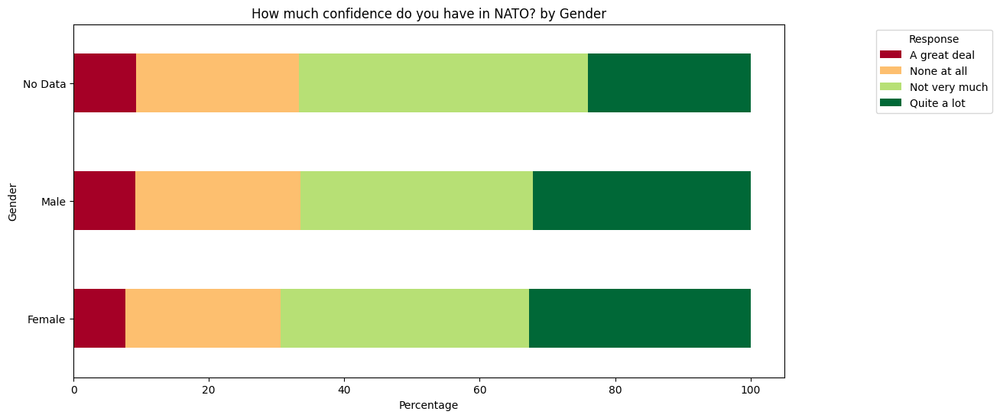
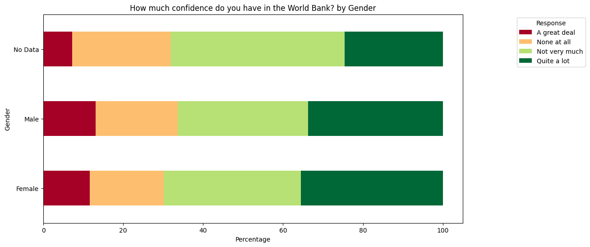
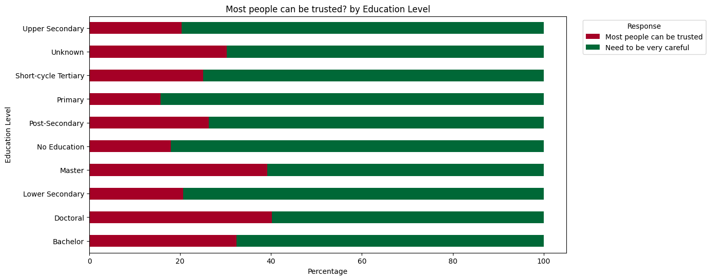
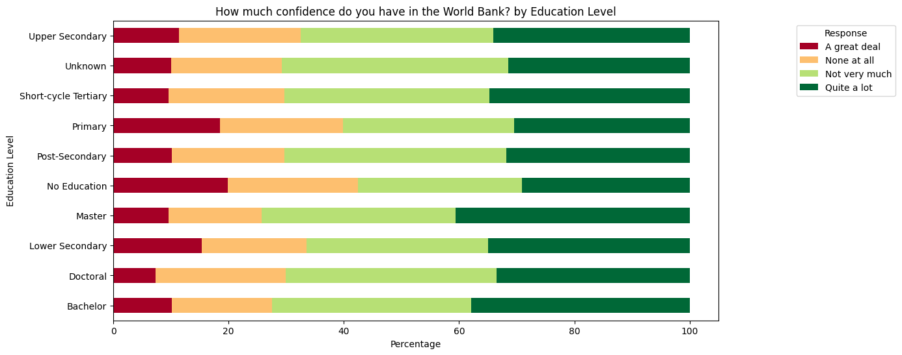

# Gender and Education Influence on Social Attitudes

## Research Question
**How do gender and education influence attitudes toward social issues?**

## Dataset Information
- **Source:** World Values Survey (WVS)  
- **Location:** `./WVS_subset.csv`  
- **Description:** This dataset is a subset of the **World Values Survey (WVS)**, a global research initiative that collects data on people's **beliefs, values, and cultural norms** across various countries. The survey covers a wide range of **social, political, and economic attitudes**.  

### **Dataset Details**
- **Time Period:** The dataset includes responses from multiple survey waves, ranging from **1981 to the most recent wave (2022)**.  
- **Number of Respondents:** The dataset consists of **approximately 97,220 respondents** from multiple countries.  
- **Countries Covered:** The WVS dataset includes **over 90 countries**, representing diverse cultural and economic backgrounds. The subset used in this analysis may contain a selection of countries relevant to gender and education research.  
- **Survey Methodology:**  
  - **Sampling:** The WVS follows **random stratified sampling** to ensure representation across different demographic groups.  
  - **Data Collection:** Face-to-face and online interviews were conducted, depending on the country's infrastructure.  
  - **Response Scale:** Many questions use **Likert-type scales** (e.g., "Strongly agree" to "Strongly disagree") or categorical responses (e.g., "Yes/No").  

### **Key Variables**
- **Gender (Q260):** Identifies the gender of the respondent (1 = Male, 2 = Female, -2/-5 = No Data).  
- **Education Level (Q275):** Measures the highest education level attained, categorized into readable groups.  
- **Social Attitude Questions:** These include **trust in institutions, gender biases, and confidence in leadership** (see Table 1 below for details).  

## Table 1: Data Description
| **Variable** | **Description** | **Possible Values** |
|-------------|----------------|---------------------|
| **Q260** | Gender of respondent | 1 = Male, 2 = Female, -2/-5 = No Data |
| **Q275** | Education Level | Converted into readable categories |
| **Q57** | Most people can be trusted? | 1 = Yes, 2 = No |
| **Q69** | Confidence in the police | Scale from 1 (Low) to 4 (High) |
| **Q86** | Confidence in NATO | Scale from 1 (Low) to 4 (High) |
| **Q265** | Is your father an immigrant? | 1 = Yes, 2 = No |
| **Q87** | Confidence in the World Bank | Scale from 1 (Low) to 4 (High) |
| **Q12** | Is tolerance an important child quality? | 1 = Yes, 2 = No |
| **Q30** | Is university more important for boys? | 1 = Agree, 2 = Disagree |
| **Q29** | Do men make better political leaders? | 1 = Agree, 2 = Disagree |
| **Q33** | Should men have more right to a job? | 1 = Agree, 2 = Disagree |
| **Q36** | Are homosexual couples as good parents? | 1 = Agree, 2 = Disagree |

## Table 2: Descriptive Statistics
Below is a dynamically generated table presenting descriptive statistics for five selected key variables:

| **Variable** | **N** | **Mean** | **Std. Dev.** | **Min** | **Median** | **Max** | **Description** |
|-------------|------|------|------------|------|--------|------|----------------|
| Most people can be trusted | 97220 | 2.22 | 1.25 | -5.00 | 2.00 | 4.00 | Measures general trust in people. |
| Confidence in the police | 97220 | 1.53 | 2.32 | -5.00 | 2.00 | 4.00 | Level of trust in law enforcement. |
| Confidence in NATO | 97220 | 1.71 | 2.08 | -5.00 | 1.00 | 4.00 | Trust in international security organizations. |
| Confidence in the World Bank | 97220 | 1.71 | 2.08 | -5.00 | 1.00 | 4.00 | Trust in global financial institutions. |
| Men should have more right to a job | 97220 | 3.02 | 1.42 | -5.00 | 3.00 | 5.00 | Attitudes towards gender bias in employment. |

## Data Visualizations
To better understand the data, the following visualizations have been generated:

### **Figures by Gender**
- **Most people can be trusted? by Gender**  
  
- **How much confidence do you have in the police? by Gender**  
  
- **How much confidence do you have in NATO? by Gender**  
  
- **Is your father an immigrant? by Gender**  
  
- **How much confidence do you have in the World Bank? by Gender**  
  

### **Figures by Education Level**
- **Most people can be trusted? by Education Level**  
  
- **How much confidence do you have in the police? by Education Level**  
  
- **How much confidence do you have in NATO? by Education Level**  
  
- **Is your father an immigrant? by Education Level**  
  
- **How much confidence do you have in the World Bank? by Education Level**  
  

_ These visualizations help illustrate the influence of gender and education on social perceptions._